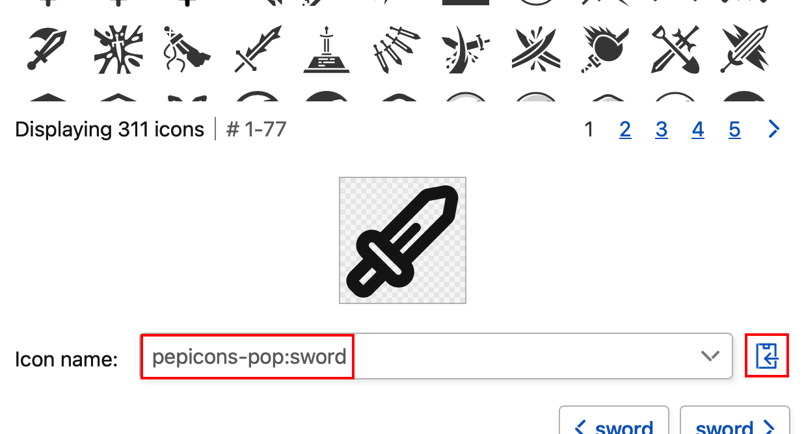

# группа (обычно люди)
Определите группы отображения для категорий, действий и предметов
- Определите группы для управления порядком отображения.
- Вы можете задать конфигурацию групп, определенных здесь, для каждой категории, действия и предмета.
- Группы с одной и той же группой отображаются рядом друг с другом.
- Если оставить пустым, то группировка не производится.
___

## ID
Уникальный ID для идентификации элемента
- ID для уникальной идентификации элемента.
- В редакторе это строка для идентификации элемента.
- Например, ID указывает, какой именно предмет будет получен после завершения действия.

!> После конфигурации ID ничего не меняйте после распространения игры. Его изменение приведет к несоответствию с существующими данными игры, и игра не будет работать должным образом.
___

### Отображаемое имя.
Отображаемое имя автоматически генерируется из ID
- В качестве символов можно использовать комбинацию букв, дефисов и количества.
- Если имя еще не задано, первая буква каждого слова пишется с заглавной буквы, а дефис заменяется пробелом, который автоматически вводится в конфигурацию имени.
- Для языков, отличных от английского, конфигурацию имени необходимо задавать отдельно.
___

#### Пример.
Реальные примеры преобразования ID
- Если ID - `stylish-strong-axe`, то имя - `Stylish Strong Axe`.
___

### Ничего не дублируется.
Запрет на дублирование ID в одном типе.
- Ничего не дублируйте в типах категорий, действий, предметов, событий и предустановок, поскольку они используются для идентификации элементов.
- Наличие одного и того же ID для разных типов не является проблемой.
- [_type_](ru/редактор/тип)
___

## Имя.
Название элемента в его нынешнем виде
- Название элемента, отображаемого в игре.
- Можно ввести и другие языки, кроме английского.
- Имена, дублирующие другие элементы, допустимы.
- Если он слишком длинный, переполненная часть не отображается на дисплее во время воспроизведения с помощью `...`.
___

### Автоматическое преобразование из ID
Автоматическое создание имен на основе ID
- Если поле оставить пустым, информация будет отображаться автоматически на основе ID. Дополнительные сведения см. в предыдущем разделе.
___

## пояснительная записка
Подробное описание элемента.
- Описание элементов, отображаемых в игре.
- Можно вводить языки, отличные от английского. Отображаются все тексты, даже длинные.
- Если объяснения нет, оставьте пустым.
___

## икона
Конфигурация значков для представления элементов.
- Иконки могут иметь конфигурацию изображения, Iconify или emojis.
- Iconify - это сервис, предлагающий широкий выбор иконок.
- Если задана конфигурация количества изображений, Iconify и пиктограмм, то они будут приоритетными и отображаться в таком порядке.
___

### Изображение.
Используйте любой файл изображения
- Изображение, представляющее элемент.
- Если размер файла велик, он автоматически изменяется.
- Не нужно, если установлена конфигурация Iconify или пиктограммы.
___

#### Тип файла.
Поддерживаемые форматы файлов изображений.
- Вы можете использовать общие типы, которые могут отображаться в браузере.
- JPEG, PNG, GIF, WebP, SVG и т.д.
___

### Iconify
Использование набора значков Iconify
- Значки, изображающие элементы.
- Iconify - это сервис, предлагающий широкий выбор иконок.
- Если задана конфигурация изображения, она будет иметь приоритет.
___

#### Iconify
Как выбрать иконки из Iconify
- Найдите в `Iconify` иконки, которые могут быть отображены.
- Вы можете быстро найти лучшие иконки с помощью поиска иконок.
- Выберите значок, чтобы увидеть его идентификатор (тип набора значков `:` имя значка), например `game-icons:sword-wound`, и вставьте его прямо в это поле значка.

- [_iconify_](https://icon-sets.iconify.design)
___

### пиктограмма
Дисплей с пиктограммами
- Отображайте пиктограммы в виде значков.
- Его можно преобразовать из текста в пиктограммы и быстро настроить конфигурацию.
- Для пиктограмм введите пиктограммы Юникода в том виде, в котором они есть.
- Поскольку используются пиктограммы, введенные в среду выполнения, для разных пользователей они отображаются по-разному.
- Iconify позволяет создавать конфигурации эмодзи, ничего не зависящие от каждого окружения.
- Непиктографические символы могут отображаться, но возможно искажение изображения при наличии количества символов.
- Введите пиктограммы, например, `🗡️` или `⚔️`.
___

## сорт
Конфигурация цвета отображения элемента.
- В качестве цвета элемента он применяется к его значку и цвету фона.
- Выберите цвет из палитры редактора.
___

### Наследование от родительских элементов
Перенимает конфигурацию цвета родительского элемента.
- Если пусто, то цвет, заданный конфигурацией родительского элемента, переходит к нему.
- Иерархия типов для каждого элемента выглядит следующим образом
- Например, если у действия есть индивидуальная конфигурация цветов, будет использоваться именно она, а если у действия нет ничего индивидуального, будет использоваться цвет категории или мира.
```
world
├── category
├── action
├── item
├── group
├── event
└── preset
```
- [_type_](ru/редактор/тип)